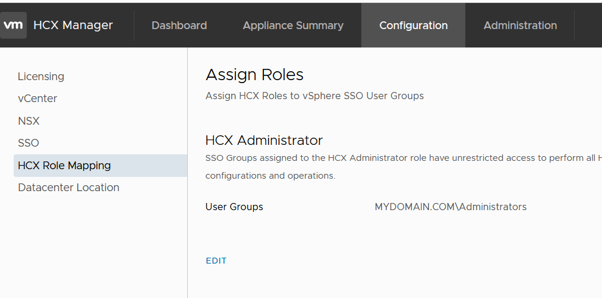

## VM appliance size

## OVA properties

## VM management

## Download the HCX initiator OVA from the VMC instance:

- Install the license
- Pair the vCenter: vCenter FQDN, SSO FQDN

- Reboot (restart of services)

- HCX Role Mapping

- Site pairing

- Network profiles (management/uplink, vMotion)

- Compute profiles

- service mesh (which consumes network profile and service mesh)